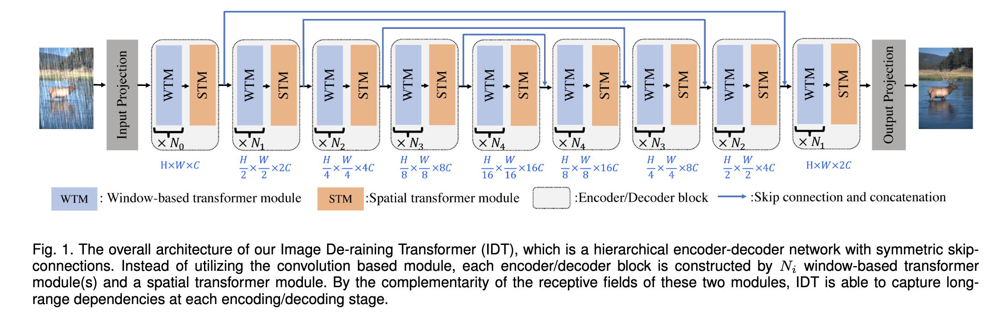
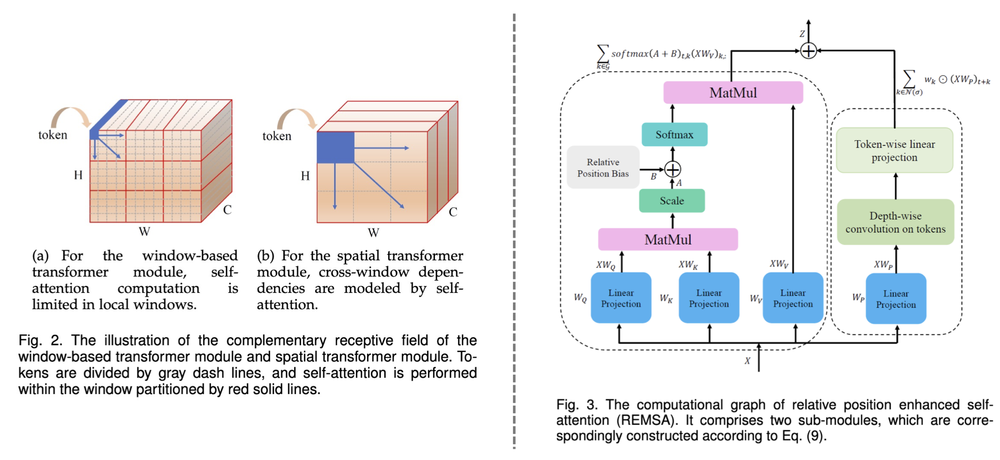

# [Image Deraining Transformer](https://ieeexplore.ieee.org/document/9798773) (IDT)

> **Abstract:** *Existing deep learning based de-raining approaches have resorted to the convolutional architectures. However, the intrinsic limitations of convolution, including local receptive fields and independence of input content, hinder the model's ability to capture long-range and complicated rainy artifacts. To overcome these limitations, we propose an effective and efficient transformer-based architecture for the image de-raining. Firstly, we introduce general priors of vision tasks, i.e., locality and hierarchy, into the network architecture so that our model can achieve excellent de-raining performance without costly pre-training. Secondly, since the geometric appearance of rainy artifacts is complicated and of significant variance in space, it is essential for de-raining models to extract both local and non-local features. Therefore, we design the complementary window-based transformer and spatial transformer to enhance locality while capturing long-range dependencies. Besides, to compensate for the positional blindness of self-attention, we establish a separate representative space for modeling positional relationship, and design a new relative position enhanced multi-head self-attention. In this way, our model enjoys powerful abilities to capture dependencies from both content and position, so as to achieve better image content recovery while removing rainy artifacts. Experiments substantiate that our approach attains more appealing results than state-of-the-art methods quantitatively and qualitatively.* 

## Method

## Dataset

-Rain200H/Rain200L: [Link](https://www.icst.pku.edu.cn/struct/Projects/joint_rain_removal.html)

-DDN-Data: [Link](https://xueyangfu.github.io/projects/cvpr2017.html)

-DID-Data: [Link](https://github.com/hezhangsprinter/DID-MDN)

-SPA-Data: [Link](https://github.com/stevewongv/SPANet)

-RainDS: [Link](https://github.com/Songforrr/RainDS_CCN)

-AGAN-Data: [Link](https://github.com/rui1996/DeRaindrop)

## Results
For research convinience, we release both derained patches as well as full-size images.
- Derain results [Google Drive](https://drive.google.com/drive/folders/17GkFCALmG50RNrc0p4Cl92rAwlVagtWs?usp=sharing)

## Evaluation

- Rain200H/Rain200L/DDN/DID/SPA: <a href="evaluaterain.m">evaluaterain.m</a>
- Raindrop: <a href="evaluate_raindrop.py">evaluate_raindrop.py</a>

## Full-size Evaluation Results
<table>
  <tr>
    <th align="left">Dataset</th>
    <th align="center">Rain200H</th>
    <th align="center">Rain200L</th>
    <th align="center">DDN-Data</th>
    <th align="center">DID-Data</th>
    <th align="center">SPA-Data</th>
    <th align="center">AGAN-Data</th>
  </tr>
  <tr>
    <td align="left">PSNR</td>
    <td align="center">32.10</td>
    <td align="center">40.74</td>
    <td align="center">33.80</td>
    <td align="center">34.85</td>
    <td align="center">47.34</td>
    <td align="center">31.63</td>
  </tr>
  <tr>
    <td align="left">SSIM</td>
    <td align="center">0.9343</td>
    <td align="center">0.9884</td>
    <td align="center">0.9407</td>
    <td align="center">0.9401</td>
    <td align="center">0.9929</td>
    <td align="center">0.9360</td>
  </tr>
</table>

## Pretrained Model
- Derain [Google Drive](https://drive.google.com/drive/folders/1PrEwOyFPciWKHC_UFe5ZE7x9JqfUkUMP?usp=sharing)

## Citation
If you use IDT, please consider citing:

    @article{xiao2022image,
        title={Image De-raining Transformer},
        author={Xiao, Jie and Fu, Xueyang and Liu, Aiping and Wu, Feng and Zha, Zheng-Jun},
        journal={IEEE Transactions on Pattern Analysis and Machine Intelligence},
        year={2022},
        publisher={IEEE}
    }

## Acknowledgement
This code is based on the [Uformer](https://github.com/ZhendongWang6/Uformer). The evaluation code borrows from [Restormer](https://github.com/swz30/Restormer) and [AttentGAN](https://github.com/rui1996/DeRaindrop).

## Contact
Please contact us if there is any question(jiexiao916@gmail.com).

